# Performance

To get an early sense of what ReJSON is capable of, you can test it with `redis-benchmark` just like
any other Redis command. However, in order to have more control over the tests, we'll be using a 
a tool written in Go called _ReJSONBenchmark_ that we expect to release in the near future.

The following figures were obtained from an AWS EC2 c4.8xlarge instance that ran both the Redis
server as well the as the benchmarking tool. Connections to the server are via the networking stack.
All tests are non-pipelined.

> NOTE: the results below are measured using the preview version of ReJSON, which is still very much
unoptimized :)

## ReJSON baseline

### A smallish object

We test a JSON value that, while purely synthetic, is interesting. The test subject is
[/test/files/pass-100.json](https://github.com/RedisLabsModules/rejson/blob/master/test/files/pass-100.json),
who weighs in at 380 bytes and is nested. We first test SETting it, then GETting it using several
different paths:

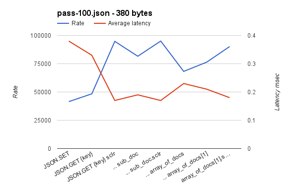

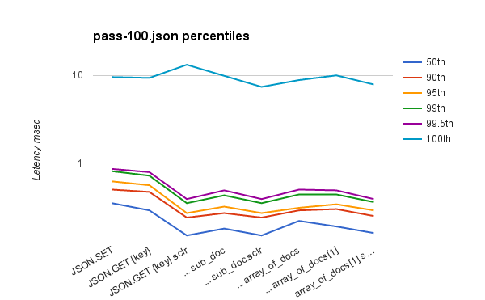

### A bigger array

Moving on to bigger values, we use the 1.4 kB array in
[/test/files/pass-jsonsl-1.json](https://github.com/RedisLabsModules/rejson/blob/master/test/files/pass-jsonsl-1.json):

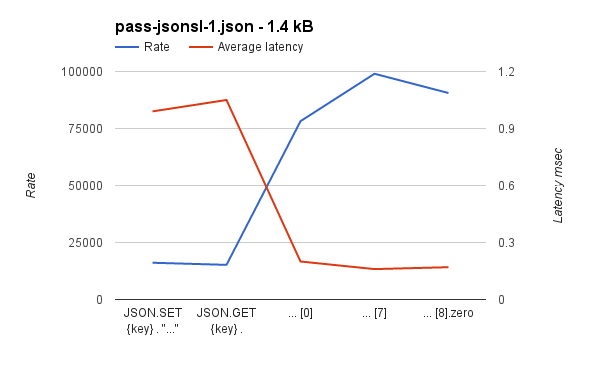


### A largish object

More of the same to wrap up, now we'll take on a behemoth of no less than 3.5 kB as given by
[/test/files/pass-json-parser-0000.json](https://github.com/RedisLabsModules/rejson/blob/master/test/files/pass-json-parser-0000.json):


### Number operations

Last but not least, some adding and multiplying:

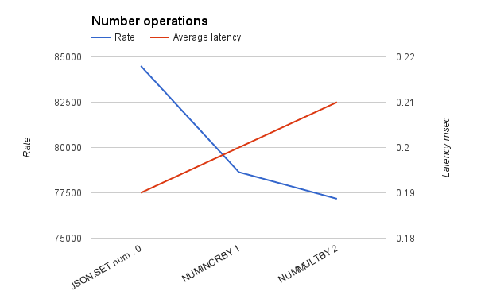

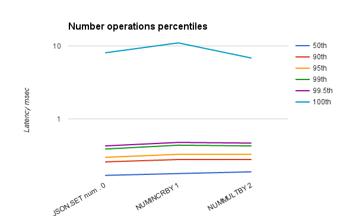

### Baseline

To establish a baseline we'll use the Redis [`PING`](https://redis.io/commands/ping) command.
First, lets see what `redis-benchmark` reports:

```
~$ redis/src/redis-benchmark -n 1000000 ping
====== ping ======
  1000000 requests completed in 7.11 seconds
  50 parallel clients
  3 bytes payload
  keep alive: 1

99.99% <= 1 milliseconds
100.00% <= 1 milliseconds
140587.66 requests per second
```

ReJSONBenchmark's concurrency is configurable, so we'll test a few settings to find a good one. Here
are the results, which indicate that 16 workers yield the best throughput:


Note how our benchmarking tool does slightly worse in PINGing producing only 116K ops, compared to
`redis-cli`'s 140K.

### The empty string

Another ReJSON benchmark is that of setting and getting an empty string - a value that's only two
bytes long (i.e. `""`). Granted, that's not very useful, but it teaches us something about the basic
performance of the module:


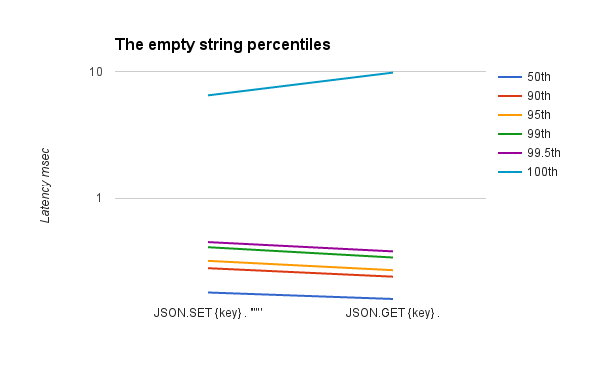

## Comparison vs. server-side Lua scripting

We compare ReJSON's performance with Redis' embedded Lua engine. For this purpose we use the Lua
scripts at [/benchmarks/lua](https://github.com/RedisLabsModules/rejson/tree/master/benchmarks/lua).
These scripts provide ReJSON's GET and SET functionality on values stored in JSON or MessagePack
formats. Each of the different operations (set root, get root, set path and get path) is executed
with each "engine" on objects of varying sizes. 

### Setting and getting the root

Storing raw JSON performs best in this test, but that isn't really surprising as all it does is
serve unprocessed strings. While you can and should use Redis for caching opaque data, and JSON
"blobs" are just one example, this does not allow any updates other than these of the entire value.

A more meaningful comparison therefore is between ReJSON and the MessagePack variant, since both
process the incoming JSON value before actually storing it. While the rates and latencies of these 
two behave in a very similar way, the absolute measurements suggest that ReJSON's performance may be
further improved.

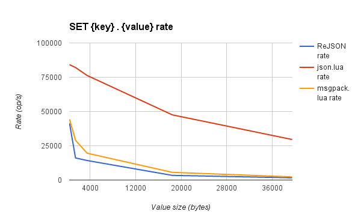

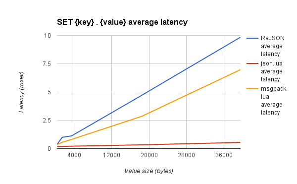

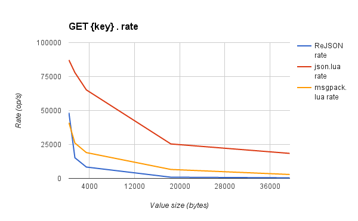

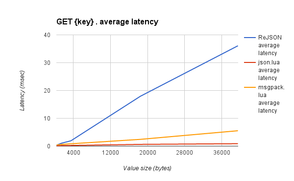

### Setting and getting parts of objects

This test shows why ReJSON is. Not only does it outperform the Lua variants, it retains constant
rates and latencies regardless the object's overall size. There's no magic here - ReJSON keeps the
value desrialized so accessing parts of it is a relatively inexpensive operation. In deep contrast
are both raw JSON as well as MessagePack who require decoding the entire object before anything can
be done with it, a process which becomes more expensive the larger the object is.

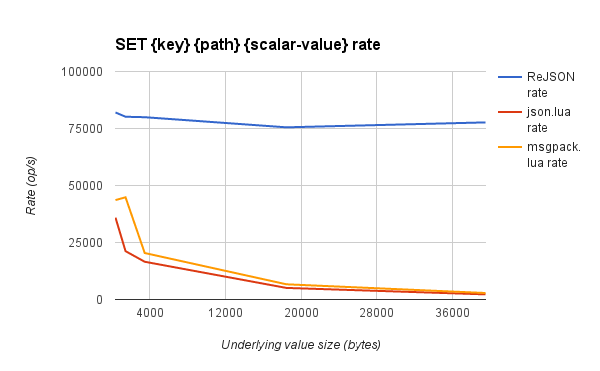

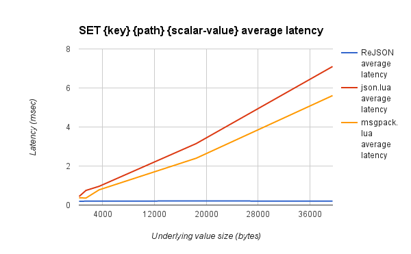

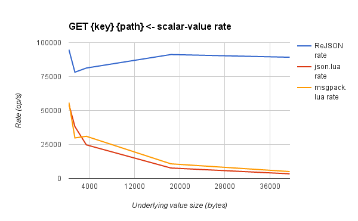

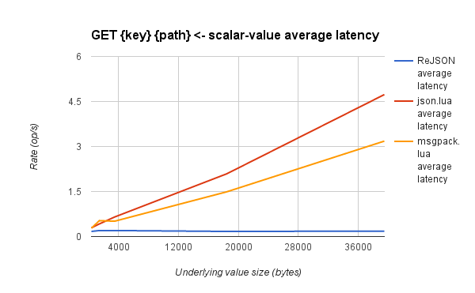

### Even more charts

These charts are more of the same but independently for each file (value):

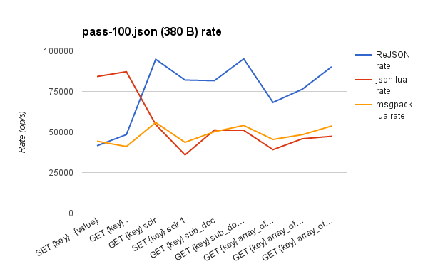

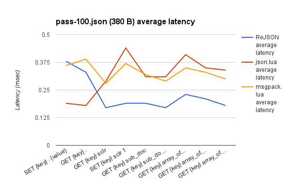

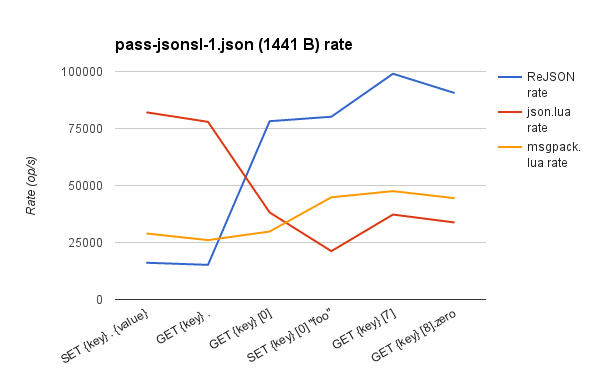

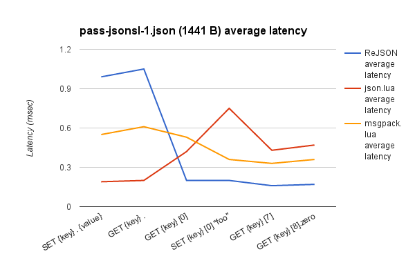

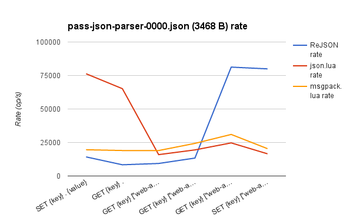

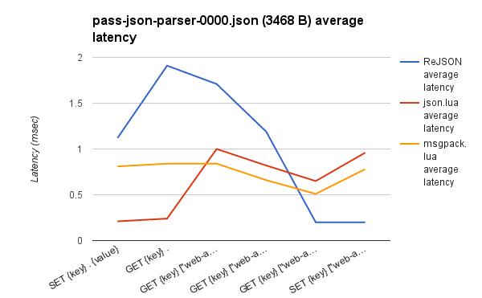

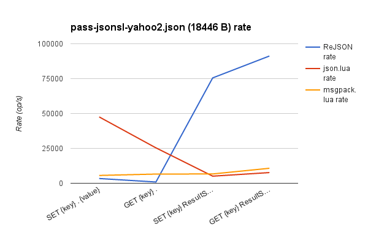

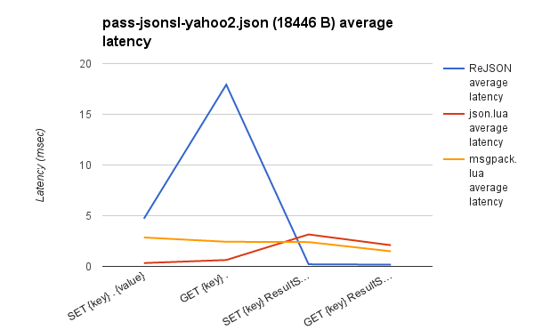

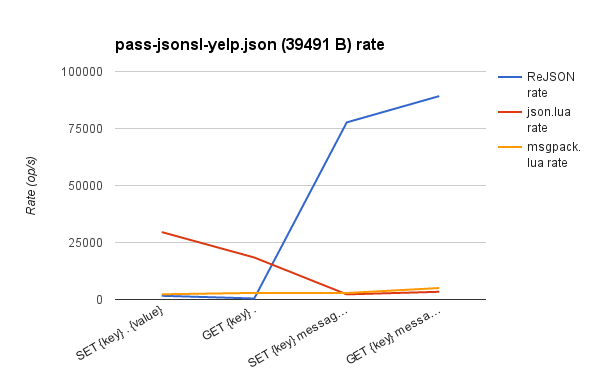

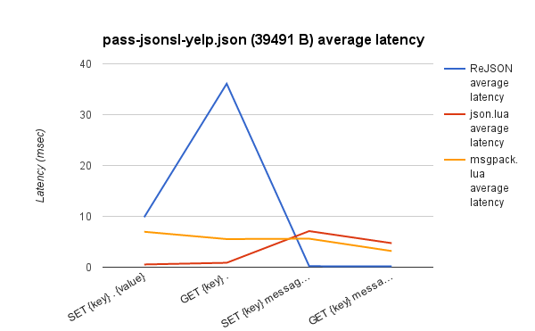

## Raw results

The following are the raw results from the benchmark in CSV format.

### ReJSON results

```
title,concurrency,rate,average latency,50.00%-tile,90.00%-tile,95.00%-tile,99.00%-tile,99.50%-tile,100.00%-tile
[ping],1,22128.12,0.04,0.04,0.04,0.05,0.05,0.05,1.83
[ping],2,54641.13,0.04,0.03,0.05,0.05,0.06,0.07,2.14
[ping],4,76000.18,0.05,0.05,0.07,0.07,0.09,0.10,2.10
[ping],8,106750.99,0.07,0.07,0.10,0.11,0.14,0.16,2.99
[ping],12,111297.33,0.11,0.10,0.15,0.16,0.20,0.22,6.81
[ping],16,116292.19,0.14,0.13,0.19,0.21,0.27,0.33,7.50
[ping],20,110622.82,0.18,0.17,0.24,0.27,0.38,0.47,12.21
[ping],24,107468.51,0.22,0.20,0.31,0.38,0.58,0.71,13.86
[ping],28,102827.35,0.27,0.25,0.38,0.44,0.66,0.79,12.87
[ping],32,105733.51,0.30,0.28,0.42,0.50,0.79,0.97,10.56
[ping],36,102046.43,0.35,0.33,0.48,0.56,0.90,1.13,14.66
JSON.SET {key} . {empty string size: 2 B},16,80276.63,0.20,0.18,0.28,0.32,0.41,0.45,6.48
JSON.GET {key} .,16,92191.23,0.17,0.16,0.24,0.27,0.34,0.38,9.80
JSON.SET {key} . {pass-100.json size: 380 B},16,41512.77,0.38,0.35,0.50,0.62,0.81,0.86,9.56
JSON.GET {key} .,16,48374.10,0.33,0.29,0.47,0.56,0.72,0.79,9.36
JSON.GET {key} sclr,16,94801.23,0.17,0.15,0.24,0.27,0.35,0.39,13.21
JSON.SET {key} sclr 1,16,82032.08,0.19,0.18,0.27,0.31,0.40,0.44,8.97
JSON.GET {key} sub_doc,16,81633.51,0.19,0.18,0.27,0.32,0.43,0.49,9.88
JSON.GET {key} sub_doc.sclr,16,95052.35,0.17,0.15,0.24,0.27,0.35,0.39,7.39
JSON.GET {key} array_of_docs,16,68223.05,0.23,0.22,0.29,0.31,0.44,0.50,8.84
JSON.GET {key} array_of_docs[1],16,76390.57,0.21,0.19,0.30,0.34,0.44,0.49,9.99
JSON.GET {key} array_of_docs[1].sclr,16,90202.13,0.18,0.16,0.25,0.29,0.36,0.39,7.87
JSON.SET {key} . {pass-jsonsl-1.json size: 1.4 kB},16,16117.11,0.99,0.91,1.22,1.55,2.17,2.35,9.27
JSON.GET {key} .,16,15193.51,1.05,0.94,1.41,1.75,2.33,2.42,7.19
JSON.GET {key} [0],16,78198.90,0.20,0.19,0.29,0.33,0.42,0.47,10.87
"JSON.SET {key} [0] ""foo""",16,80156.90,0.20,0.18,0.28,0.32,0.40,0.44,12.03
JSON.GET {key} [7],16,99013.98,0.16,0.15,0.23,0.26,0.34,0.38,7.67
JSON.GET {key} [8].zero,16,90562.19,0.17,0.16,0.25,0.28,0.35,0.38,7.03
JSON.SET {key} . {pass-json-parser-0000.json size: 3.5 kB},16,14239.25,1.12,1.06,1.21,1.48,2.35,2.59,11.91
JSON.GET {key} .,16,8366.31,1.91,1.86,2.00,2.04,2.92,3.51,12.92
"JSON.GET {key} [""web-app""].servlet",16,9339.90,1.71,1.68,1.74,1.78,2.68,3.26,10.47
"JSON.GET {key} [""web-app""].servlet[0]",16,13374.88,1.19,1.07,1.54,1.95,2.69,2.82,12.15
"JSON.GET {key} [""web-app""].servlet[0][""servlet-name""]",16,81267.36,0.20,0.18,0.28,0.31,0.38,0.42,9.67
"JSON.SET {key} [""web-app""].servlet[0][""servlet-name""] ""bar""",16,79955.04,0.20,0.18,0.27,0.33,0.42,0.46,6.72
JSON.SET {key} . {pass-jsonsl.yahoo2-json size: 18 kB},16,3394.07,4.71,4.62,4.72,4.79,7.35,9.03,17.78
JSON.GET {key} .,16,891.46,17.92,17.33,17.56,20.12,31.77,42.87,66.64
JSON.SET {key} ResultSet.totalResultsAvailable 1,16,75513.03,0.21,0.19,0.30,0.34,0.42,0.46,9.21
JSON.GET {key} ResultSet.totalResultsAvailable,16,91202.84,0.17,0.16,0.24,0.28,0.35,0.38,5.30
JSON.SET {key} . {pass-jsonsl-yelp.json size: 40 kB},16,1624.86,9.84,9.67,9.86,9.94,15.86,19.36,31.94
JSON.GET {key} .,16,442.55,36.08,35.62,37.78,38.14,55.23,81.33,88.40
JSON.SET {key} message.code 1,16,77677.25,0.20,0.19,0.28,0.33,0.42,0.45,11.07
JSON.GET {key} message.code,16,89206.61,0.18,0.16,0.25,0.28,0.36,0.39,8.60
[JSON.SET num . 0],16,84498.21,0.19,0.17,0.26,0.30,0.39,0.43,8.08
[JSON.NUMINCRBY num . 1],16,78640.20,0.20,0.18,0.28,0.33,0.44,0.48,11.05
[JSON.NUMMULTBY num . 2],16,77170.85,0.21,0.19,0.28,0.33,0.43,0.47,6.85
```

### Lua using cjson

```
json-set-root.lua empty string,16,86817.84,0.18,0.17,0.26,0.31,0.39,0.42,9.36
json-get-root.lua,16,90795.08,0.17,0.16,0.25,0.28,0.36,0.39,8.75
json-set-root.lua pass-100.json,16,84190.26,0.19,0.17,0.27,0.30,0.38,0.41,12.00
json-get-root.lua,16,87170.45,0.18,0.17,0.26,0.29,0.38,0.45,9.81
json-get-path.lua sclr,16,54556.80,0.29,0.28,0.35,0.38,0.57,0.64,7.53
json-set-path.lua sclr 1,16,35907.30,0.44,0.42,0.53,0.67,0.93,1.00,8.57
json-get-path.lua sub_doc,16,51158.84,0.31,0.30,0.36,0.39,0.50,0.62,7.22
json-get-path.lua sub_doc sclr,16,51054.47,0.31,0.29,0.39,0.47,0.66,0.74,7.43
json-get-path.lua array_of_docs,16,39103.77,0.41,0.37,0.57,0.68,0.87,0.94,8.02
json-get-path.lua array_of_docs 1,16,45811.31,0.35,0.32,0.45,0.56,0.77,0.83,8.17
json-get-path.lua array_of_docs 1 sclr,16,47346.83,0.34,0.31,0.44,0.54,0.72,0.79,8.07
json-set-root.lua pass-jsonsl-1.json,16,82100.90,0.19,0.18,0.28,0.31,0.39,0.43,12.43
json-get-root.lua,16,77922.14,0.20,0.18,0.30,0.34,0.66,0.86,8.71
json-get-path.lua 0,16,38162.83,0.42,0.40,0.49,0.59,0.88,0.96,6.16
"json-set-path.lua 0 ""foo""",16,21205.52,0.75,0.70,0.84,1.07,1.60,1.74,5.77
json-get-path.lua 7,16,37254.89,0.43,0.39,0.55,0.69,0.92,0.98,10.24
json-get-path.lua 8 zero,16,33772.43,0.47,0.43,0.63,0.77,1.01,1.09,7.89
json-set-root.lua pass-json-parser-0000.json,16,76314.18,0.21,0.19,0.29,0.33,0.41,0.44,8.16
json-get-root.lua,16,65177.87,0.24,0.21,0.35,0.42,0.89,1.01,9.02
json-get-path.lua web-app servlet,16,15938.62,1.00,0.88,1.45,1.71,2.11,2.20,8.07
json-get-path.lua web-app servlet 0,16,19469.27,0.82,0.78,0.90,1.07,1.67,1.84,7.59
json-get-path.lua web-app servlet 0 servlet-name,16,24694.26,0.65,0.63,0.71,0.74,1.07,1.31,8.60
"json-set-path.lua web-app servlet 0 servlet-name ""bar""",16,16555.74,0.96,0.92,1.05,1.25,1.98,2.20,9.08
json-set-root.lua pass-jsonsl-yahoo2.json,16,47544.65,0.33,0.31,0.41,0.47,0.59,0.64,10.52
json-get-root.lua,16,25369.92,0.63,0.57,0.91,1.05,1.37,1.56,9.95
json-set-path.lua ResultSet totalResultsAvailable 1,16,5077.32,3.15,3.09,3.20,3.24,5.12,6.26,14.98
json-get-path.lua ResultSet totalResultsAvailable,16,7652.56,2.09,2.05,2.13,2.17,3.23,3.95,9.65
json-set-root.lua pass-jsonsl-yelp.json,16,29575.20,0.54,0.52,0.64,0.75,0.94,1.00,12.66
json-get-root.lua,16,18424.29,0.87,0.84,1.25,1.40,1.82,1.95,7.35
json-set-path.lua message code 1,16,2251.07,7.10,6.98,7.14,7.22,11.00,12.79,21.14
json-get-path.lua message code,16,3380.72,4.73,4.44,5.03,6.82,10.28,11.06,14.93
```

### Lua using cmsgpack

```
msgpack-set-root.lua empty string,16,82592.66,0.19,0.18,0.27,0.31,0.38,0.42,10.18
msgpack-get-root.lua,16,89561.41,0.18,0.16,0.25,0.29,0.37,0.40,9.52
msgpack-set-root.lua pass-100.json,16,44326.47,0.36,0.34,0.43,0.54,0.78,0.86,6.45
msgpack-get-root.lua,16,41036.58,0.39,0.36,0.51,0.62,0.84,0.91,7.21
msgpack-get-path.lua sclr,16,55845.56,0.28,0.26,0.36,0.44,0.64,0.70,11.29
msgpack-set-path.lua sclr 1,16,43608.26,0.37,0.34,0.47,0.58,0.78,0.85,10.27
msgpack-get-path.lua sub_doc,16,50153.07,0.32,0.29,0.41,0.50,0.69,0.75,8.56
msgpack-get-path.lua sub_doc sclr,16,54016.35,0.29,0.27,0.38,0.46,0.62,0.67,6.38
msgpack-get-path.lua array_of_docs,16,45394.79,0.35,0.32,0.45,0.56,0.78,0.85,11.88
msgpack-get-path.lua array_of_docs 1,16,48336.48,0.33,0.30,0.42,0.52,0.71,0.76,7.69
msgpack-get-path.lua array_of_docs 1 sclr,16,53689.41,0.30,0.27,0.38,0.46,0.64,0.69,11.16
msgpack-set-root.lua pass-jsonsl-1.json,16,28956.94,0.55,0.51,0.65,0.82,1.17,1.26,8.39
msgpack-get-root.lua,16,26045.44,0.61,0.58,0.68,0.83,1.28,1.42,8.56
"msgpack-set-path.lua 0 ""foo""",16,29813.56,0.53,0.49,0.67,0.83,1.15,1.22,6.82
msgpack-get-path.lua 0,16,44827.58,0.36,0.32,0.48,0.58,0.76,0.81,9.19
msgpack-get-path.lua 7,16,47529.14,0.33,0.31,0.42,0.53,0.73,0.79,7.47
msgpack-get-path.lua 8 zero,16,44442.72,0.36,0.33,0.45,0.56,0.77,0.85,8.11
msgpack-set-root.lua pass-json-parser-0000.json,16,19585.82,0.81,0.78,0.85,1.05,1.66,1.86,4.33
msgpack-get-root.lua,16,19014.08,0.84,0.73,1.23,1.45,1.76,1.84,13.52
msgpack-get-path.lua web-app servlet,16,18992.61,0.84,0.73,1.23,1.45,1.75,1.82,8.19
msgpack-get-path.lua web-app servlet 0,16,24328.78,0.66,0.64,0.73,0.77,1.15,1.34,8.81
msgpack-get-path.lua web-app servlet 0 servlet-name,16,31012.81,0.51,0.49,0.57,0.65,1.02,1.13,8.11
"msgpack-set-path.lua web-app servlet 0 servlet-name ""bar""",16,20388.54,0.78,0.73,0.88,1.08,1.63,1.78,7.22
msgpack-set-root.lua pass-jsonsl-yahoo2.json,16,5597.60,2.85,2.81,2.89,2.94,4.57,5.59,10.19
msgpack-get-root.lua,16,6585.01,2.43,2.39,2.52,2.66,3.76,4.80,10.59
msgpack-set-path.lua ResultSet totalResultsAvailable 1,16,6666.95,2.40,2.35,2.43,2.47,3.78,4.59,12.08
msgpack-get-path.lua ResultSet totalResultsAvailable,16,10733.03,1.49,1.45,1.60,1.66,2.36,2.93,13.15
msgpack-set-root-lua pass-jsonsl-yelp.json,16,2291.53,6.97,6.87,7.01,7.12,10.54,12.89,21.75
msgpack-get-root.lua,16,2889.59,5.53,5.45,5.71,5.86,8.80,10.48,25.55
msgpack-set-path.lua message code 1,16,2847.85,5.61,5.44,5.56,6.01,10.58,11.90,16.91
msgpack-get-path.lua message code,16,5030.95,3.18,3.07,3.24,3.57,6.08,6.92,12.44
```