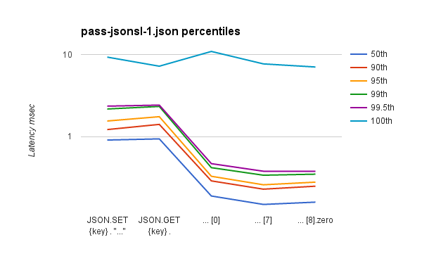
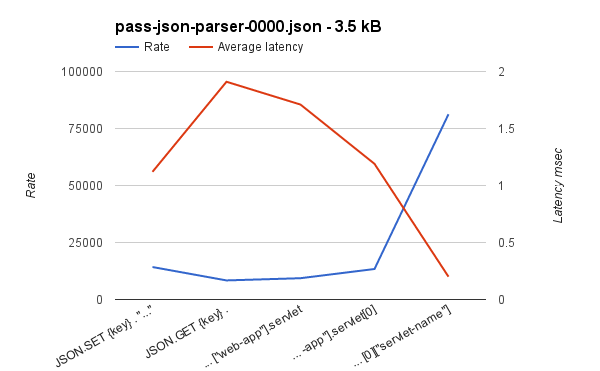
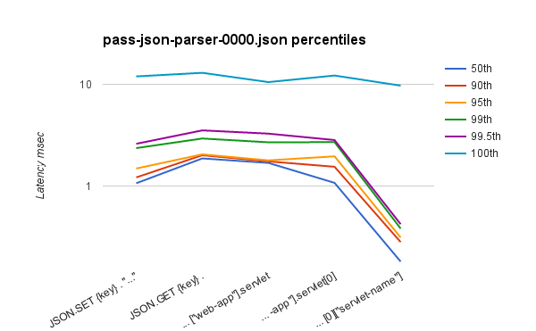
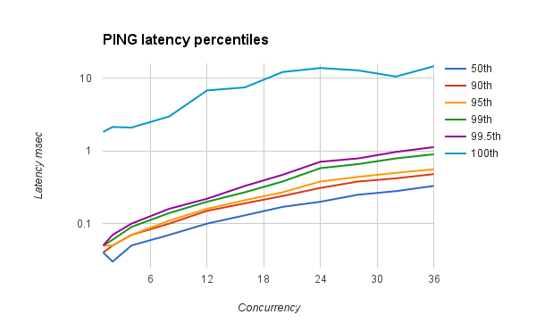
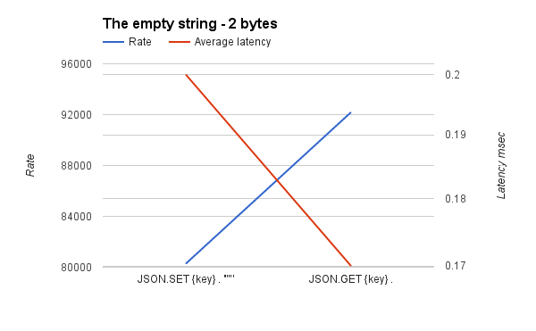

# Performance

To get an early sense of what ReJSON is capable of, you can test it with `redis-benchmark` just like
any other Redis command. However, in order to have more control over the tests, we'll be using a 
a tool written in Go called _ReJSONBenchmark_ that we expect to release in the near future.

The following figures were obtained from an AWS EC2 c4.8xlarge instance that ran both the Redis
server as well the as the benchmarking tool. Connections to the server are via the networking stack.
All tests are non-pipelined.

> NOTE: the results below are measured using the preview version of ReJSON, which is still very much
unoptimized :)

## An smallish object

We test a JSON value that, while purely synthetic, is interesting. The test subject is
[/test/files/pass-100.json](https://github.com/RedisLabsModules/rejson/blob/master/test/files/pass-100.json),
who weighs in at 380 bytes and is nested. We first test SETting it, then GETting it using several
different paths:


## A bigger array

Moving on to bigger values, we use the 1.4 kB array in
[/test/files/pass-jsonsl-1.json](https://github.com/RedisLabsModules/rejson/blob/master/test/files/pass-jsonsl-1.json):




## A largish object

More of the same to wrap up, now we'll take on a behemoth of no less than 3.5 kB as given by
[/test/files/pass-json-parser-0000.json](https://github.com/RedisLabsModules/rejson/blob/master/test/files/pass-json-parser-0000.json):





## Number operations

Last but not least, some adding and multiplying:


## Baseline

To establish a baseline we'll use the Redis [`PING`](https://redis.io/commands/ping) command.
First, lets see what `redis-benchmark` reports:

```
~$ redis/src/redis-benchmark -n 1000000 ping
====== ping ======
  1000000 requests completed in 7.11 seconds
  50 parallel clients
  3 bytes payload
  keep alive: 1

99.99% <= 1 milliseconds
100.00% <= 1 milliseconds
140587.66 requests per second
```

ReJSONBenchmark's concurrency is configurable, so we'll test a few settings to find a good one. Here
are the results, which indicate that 16 workers yield the best throughput:




Note how our benchmarking tool does slightly worse in PINGing producing only 116K ops, compared to
`redis-cli`'s 140K.

## The empty string

Another ReJSON benchmark is that of setting and getting an empty string - a value that's only two
bytes long (i.e. `""`). Granted, that's not very useful, but it teaches us something about the basic
performance of the module:




## Raw results

The following are the raw results from the benchmark in CSV format:

```
title,concurrency,rate,average latency,50.00%-tile,90.00%-tile,95.00%-tile,99.00%-tile,99.50%-tile,100.00%-tile
[ping],1,22128.12,0.04,0.04,0.04,0.05,0.05,0.05,1.83
[ping],2,54641.13,0.04,0.03,0.05,0.05,0.06,0.07,2.14
[ping],4,76000.18,0.05,0.05,0.07,0.07,0.09,0.10,2.10
[ping],8,106750.99,0.07,0.07,0.10,0.11,0.14,0.16,2.99
[ping],12,111297.33,0.11,0.10,0.15,0.16,0.20,0.22,6.81
[ping],16,116292.19,0.14,0.13,0.19,0.21,0.27,0.33,7.50
[ping],20,110622.82,0.18,0.17,0.24,0.27,0.38,0.47,12.21
[ping],24,107468.51,0.22,0.20,0.31,0.38,0.58,0.71,13.86
[ping],28,102827.35,0.27,0.25,0.38,0.44,0.66,0.79,12.87
[ping],32,105733.51,0.30,0.28,0.42,0.50,0.79,0.97,10.56
[ping],36,102046.43,0.35,0.33,0.48,0.56,0.90,1.13,14.66
JSON.SET {key} . {empty string size: 2 B},16,80276.63,0.20,0.18,0.28,0.32,0.41,0.45,6.48
JSON.GET {key} .,16,92191.23,0.17,0.16,0.24,0.27,0.34,0.38,9.80
JSON.SET {key} . {pass-100.json size: 380 B},16,41512.77,0.38,0.35,0.50,0.62,0.81,0.86,9.56
JSON.GET {key} .,16,48374.10,0.33,0.29,0.47,0.56,0.72,0.79,9.36
JSON.GET {key} sclr,16,94801.23,0.17,0.15,0.24,0.27,0.35,0.39,13.21
JSON.GET {key} sub_doc,16,81633.51,0.19,0.18,0.27,0.32,0.43,0.49,9.88
JSON.GET {key} sub_doc.sclr,16,95052.35,0.17,0.15,0.24,0.27,0.35,0.39,7.39
JSON.GET {key} array_of_docs,16,68223.05,0.23,0.22,0.29,0.31,0.44,0.50,8.84
JSON.GET {key} array_of_docs[1],16,76390.57,0.21,0.19,0.30,0.34,0.44,0.49,9.99
JSON.GET {key} array_of_docs[1].sclr,16,90202.13,0.18,0.16,0.25,0.29,0.36,0.39,7.87
JSON.SET {key} . {pass-jsonsl-1.json size: 1.4 kB},16,16117.11,0.99,0.91,1.22,1.55,2.17,2.35,9.27
JSON.GET {key} .,16,15193.51,1.05,0.94,1.41,1.75,2.33,2.42,7.19
JSON.GET {key} [0],16,78198.90,0.20,0.19,0.29,0.33,0.42,0.47,10.87
JSON.GET {key} [7],16,99013.98,0.16,0.15,0.23,0.26,0.34,0.38,7.67
JSON.GET {key} [8].zero,16,90562.19,0.17,0.16,0.25,0.28,0.35,0.38,7.03
JSON.SET {key} . {pass-json-parser-0000.json size: 3.5 kB},16,14239.25,1.12,1.06,1.21,1.48,2.35,2.59,11.91
JSON.GET {key} .,16,8366.31,1.91,1.86,2.00,2.04,2.92,3.51,12.92
"JSON.GET {key} [""web-app""].servlet",16,9339.90,1.71,1.68,1.74,1.78,2.68,3.26,10.47
"JSON.GET {key} [""web-app""].servlet[0]",16,13374.88,1.19,1.07,1.54,1.95,2.69,2.82,12.15
"JSON.GET {key} [""web-app""].servlet[0][""servlet-name""]",16,81267.36,0.20,0.18,0.28,0.31,0.38,0.42,9.67
[JSON.SET num . 0],16,84498.21,0.19,0.17,0.26,0.30,0.39,0.43,8.08
[JSON.NUMINCRBY num . 1],16,78640.20,0.20,0.18,0.28,0.33,0.44,0.48,11.05
[JSON.NUMMULTBY num . 2],16,77170.85,0.21,0.19,0.28,0.33,0.43,0.47,6.85
```